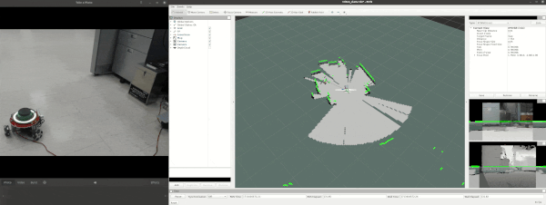

# Stingray Camera Package
This package contains the real-world triton robot with camera package. 

## Installation

### Create a Catkin Workspace (if none exists)
Follow the instructions at: https://wiki.ros.org/catkin/Tutorials/create_a_workspace

```bash
mkdir -p ~/catkin_ws/src
cd ~/catkin_ws/
catkin_make
```

### Download the Stingray Camera Repository
```bash
cd ~/catkin_ws/src
git clone https://gitlab.com/HCRLab/stingray-robotics/stingray_camera.git
```

### Download the RPLIDAR ROS Repository
```bash
cd ~/catkin_ws/src
git clone https://github.com/Slamtec/rplidar_ros.git
```

### Install Realsense Camera package
If it is not yet installed, follow the instructions to install the Intel Realsense Camera for your ROS1 version: https://github.com/IntelRealSense/realsense-ros/tree/ros1-legacy. 

```bash
sudo apt install ros-$ROS_DISTRO-realsense2-camera
```

### Install ROS and Python Dependencies for your ROS version
```bash
sudo apt install ros-$ROS_DISTRO-gazebo-ros-pkgs ros-$ROS_DISTRO-depthimage-to-laserscan ros-$ROS_DISTRO-gmapping ros-$ROS_DISTRO-hector-mapping ros-$ROS_DISTRO-amcl ros-$ROS_DISTRO-map-server
pip install pynput
pip3 install pynput
```

### Run catkin_make
```bash
cd ~/catkin_ws
catkin_make
```

## Running the Triton Package

### Run the base Triton package
This launch file This launch file does four things: 
- Run the `rosserial_python` package that allows ROS to communicate with the low-level Arduino controller (via the USB-serial connect at `/tty/ACM0` port) for sending velocity and LED color commands, and receiving odometry data
- Run several `static_transform_publisher` nodes that provide necessary TF transforms
- Launch the `realsense2_camera` package to initialize the RGB-D camera and start publishing the associated camera ROS topics
- Launch the `rplidar_ros` package to initialize the RPLIDAR A2M12 sensor and start publishing the associated LIDAR ROS topic

```bash
cd ~/catkin_ws
source devel/setup.bash
roslaunch stingray_camera triton.launch
```

### ROS Topics

After successfully running this package, you should have the following ROS topics (shown in the RosGraph below):


The `/cmd_vel` accepts a `geometry_msgs/Twist` message (similar to the Triton simulator in `stingray_sim`). 

The `/cmd_color` topic  accepts a `std_msgs/Int32` message representing an RGB value (0xFF0000 is RED, 0x00FF00 is GREEN, 0x0000FF is BLUE). This controls the color of the LED ring at the top of the robot. By default, this is set to BLUE during startup, GREEN when the `triton.launch` file is run and the Jetson successfully connects to the Arduino, and RED when the launch file is killed and the connection between the Jetson and Arduino is lost. However, you can send commands directly to change it at anytime if you want to have visual feedback of the robot's status or just for design. 

The `/scan` topic is published by the `rplidar_ros` package which has 

The `/camera/color/image_raw` topic is published by the `realsense2_ros` with messages of type `sensor_msgs/Image` that contains the current RGB image frame detected by the camera. Similarly, the `/camera/aligned_depth_to_color/image_raw` topic is also published by the same package and has the same message type, but instead contains the current depth image frame detected by the camera. We prefer this instead of `/camera/depth/image_rect_raw` since the former is already automatically aligned by the package with the RGB image. 

### ROS TF Transforms

After successfully running this package, you should also have the follow TF transforms (shown in the RosTfTree below):


The transform between the `map` and `world` frames is broadcast to be at the same relative pose by a `static_transform_publisher`. 

The transform between the `odom` and `base_link` frames is broadcast by the `/stingray_llc` node based on the odometry information computed from the motor encoders. In general, this transform generally drifts due to errors in the odometry (e.g. wheel slip, ) and you should not rely on this to be accurate over time. Instead, you may use a SLAM (e.g., GMapping or Hector Mapping) or localization (e.g., particle filter/AMCL) algorithm/package to automatically correct the robot's actual pose with respect to the `map` or `world` frames. These SLAM/localization packages usually publish a transform between the `/map` and `/base_link` frames directly which you can visualize on RViz. 

The transform between the `base_link` and `base_scan` frames is broadcast with zero `x` and `y` offsets, but with a `z` offset of `0.161m` (since the LIDAR is positioned concentric but raised on top of the robot) using a `static_transform_publisher`. There is also a transform between the `base_scan` and `laser` frames by a `static_transform_publisher` in order to directly show the LIDAR points on RViz. 

The transform between the `base_link` and `camera_link` frames is broadcast with an `x` offset of `0.09m` and `z` offset of `0.161m` using a `static_transform_publisher`. The rest of the `camera_*` to `camera_*` transforms are broadcast by the `realsense2_ros` package. 


## Running Additional ROS Packages
With the `stingray_camera` package running in the real-world Triton robot, it is now possible to run additional ROS packages to build more complex robot applications. The packages below can either be run directly on the Triton robot or on a networked ROS machine. If you are running all ROS packages directly on the Triton robot, you can simply set `ROS_MASTER_URI` and `ROS_IP` to `localhost` and not worry about your networking setup: 
- `export ROS_IP=localhost`
- `export ROS_MASTER_URI=http://localhost:11311`

### Remote Machine: Networking Setup

However, if you want to run the ROS packages on a separate remote machine, ensure that the Triton robot and your remote machine are connected to the same Local Area Network and both are fully visible to each other. Note that university WiFi networks (e.g., UMASS, eduroam and CICS) may not allow peer-to-peer WiFi communication. A workaround is to connect both machines to your mobile phone's hotspot connection which usually allows peer-to-peer communication and full visibility, or to your home WiFi connection. It may also be possible to connect from your machine via ethernet cable directly to the Jetson Nano on the Triton robot, but you may have to configure IP address/subnet/gateway settings manually. 

With a proper networking setup, let us assume that the Triton robot's IP address is `192.168.0.10` and the remote machine's IP address is `192.168.0.20` (you may change these values accordingly by checking `ifconfig` or `ip addr` on the terminal). Then, ensure that you set the following environment variables (e.g., possibly in the `~/.bashrc` file of the user where you plan to run the ROS packages): 
- Set the `ROS_IP` and `ROS_MASTER_URI` of the Triton robot to itself, since we are running the ROS master on the Triton robot: 
    - `export ROS_IP=192.168.0.10`
    - `export ROS_MASTER_URI=http://192.168.0.10:11311`
- Set the `ROS_IP` of the remote machine to itself, and the `ROS_MASTER_URI` to the Triton robot's IP address: 
    - `export ROS_IP=192.168.0.20`
    - `export ROS_MASTER_URI=http://192.168.0.10:11311`

### Robot Teleoperation (Optional)
You can move the robot manually using the `teleop_robot.py` script in the `stingray_camera` package. 

On a separate terminal, run: 
```bash
cd ~/catkin_ws
source devel/setup.bash
rosrun stingray_camera teleop_robot.py
```

__NOTE__: The default linear speed of this teleop file is 0.2m/s while the default angular speed is 1.0rad/s. The triton robot's maximum speed is limited to 0.3m/s in any direction due to motor limitations. If you send a velocity command which results in more than 0.3m/s speed, it will be capped to 0.3m/s. Similarly, the maximum angular speed supported by the triton robot is 1.5rad/s. 

### Run SLAM with GMapping (Optional)
This SLAM method allows the robot to build a map of its surroundings using only LIDAR sensor readings without needing odometry data. More details here: https://wiki.ros.org/gmapping

```bash
cd ~/catkin_ws
source devel/setup.bash
roslaunch stingray_camera triton_gmapping.launch
```



### Run SLAM with Hector Mapping (Optional)
This SLAM method allows the robot to build a map of its surroundings using only LIDAR sensor readings without needing odometry data (i.e. it can publish an estimated/fake "odometry" transform computed from the LIDAR data). More details here: https://wiki.ros.org/hector_slam

```bash
cd ~/catkin_ws
source devel/setup.bash
roslaunch stingray_camera triton_hectormapping.launch
```

### Saving and loading the Map (Optional)
After you have a complete map from either SLAM method, you can save it using the `map_server` package:

```bash
rosrun map_server map_saver -f ~/map
```

If needed, it is also possible to load the map and broadcast it to the `/map` topic using the 

```bash
rosrun map_server map_server ~/map.yaml
```

### Run Localization with AMCL/Particle Filter (Optional)
Adaptive Monte Carlo (AMCL) is a ROS package that implements a particle filter against a known map. You may directly use this package if you need localization, or you may also utilize your own particle filter implementation if available. The `triton_amcl.launch` file uses an omnidirectional motion model by default since the Triton robot is omnidirectional. More details here: https://wiki.ros.org/amcl

```bash
cd ~/catkin_ws
source devel/setup.bash
roslaunch stingray_camera triton_amcl.launch
```


